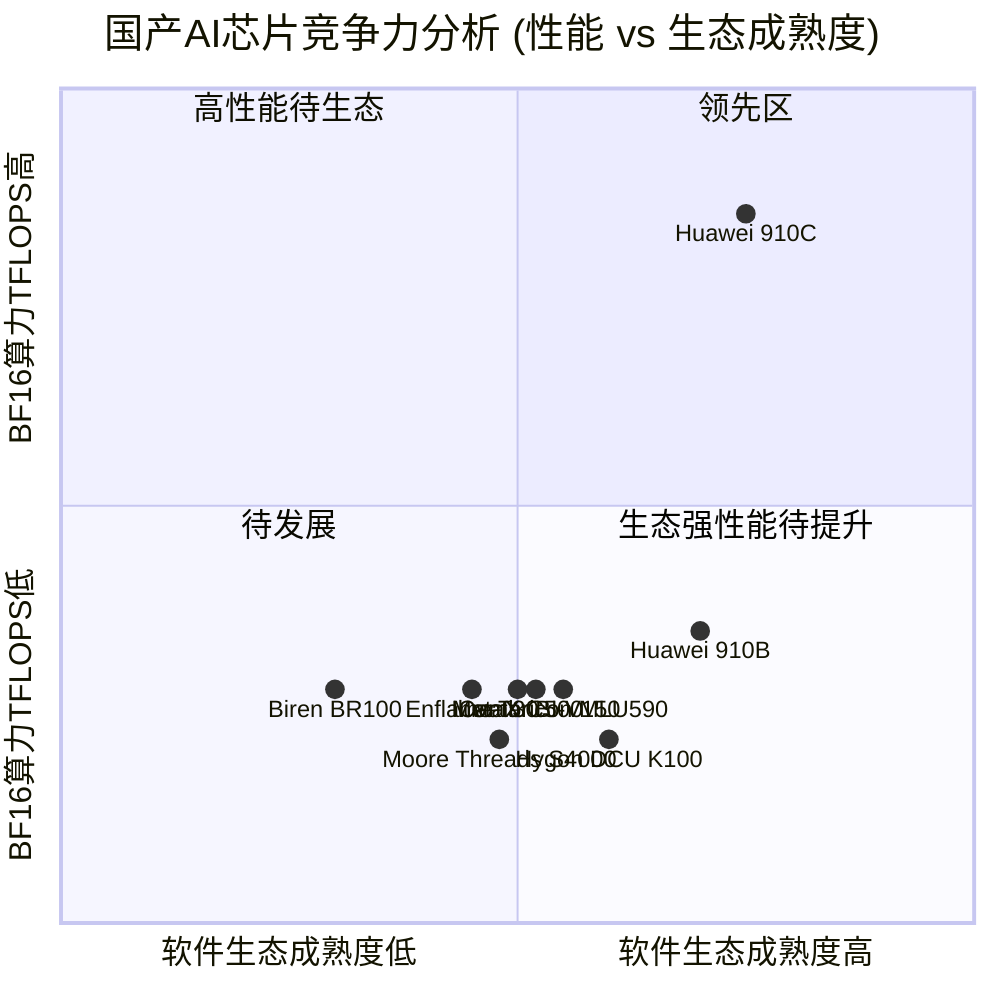
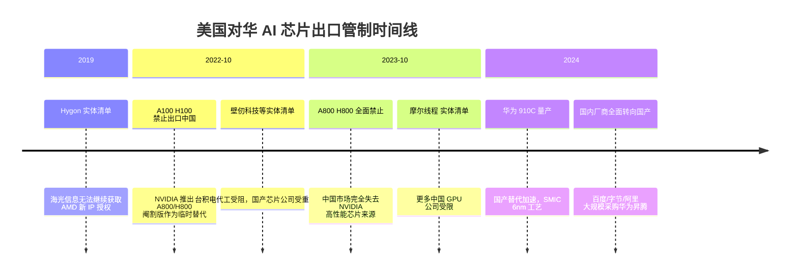

# 🤖 AI Chips Industry Analysis — aichips

> **数据仓库** | AI 芯片行业商业信息分析与产品路线图  
> AI Chip Industry Commercial Intelligence & Product Roadmap

---

## 📋 目录 / Table of Contents

- [市场概览 Market Overview](#-市场概览-market-overview)
- [产品上市时间路线图 Product Launch Roadmap](#-产品上市时间路线图-product-launch-roadmap)
- [AI 芯片产品对比 Chip Comparison](#-ai-芯片产品对比-chip-comparison)
  - [数据中心训练芯片 Data Center Training Chips](#数据中心训练芯片-data-center-training)
  - [中国国产 AI 芯片 China Domestic AI Chips](#中国国产-ai-芯片-china-domestic-ai-chips)
  - [边缘/车载 AI 芯片 Edge & Automotive AI Chips](#边缘车载-ai-芯片-edge--automotive-ai-chips)
- [公司分析 Company Profiles](#-公司分析-company-profiles)
  - [全球头部厂商 Global Leaders](#全球头部厂商-global-leaders)
  - [中国主要厂商 China Players](#中国主要厂商-china-players)
- [中国市场分析 China Market Analysis](#-中国市场分析-china-market-analysis)
- [数据文件 Data Files](#-数据文件-data-files)

---

## 📊 市场概览 Market Overview

> 注：1亿 = 100 million；$680 亿 = $68 billion USD

| 指标 | 数值 (亿元/USD) | 折算 (Billion USD) |
|------|---------------|-------------------|
| 全球 AI 芯片市场规模 (2023) | $680 亿 | $68B |
| 全球 AI 芯片市场规模 (2028 预测) | $3,110 亿 | $311B |
| 年复合增长率 CAGR (2023-2028) | **35%** | — |
| 中国 AI 芯片市场 (2023) | $120 亿 | $12B |
| 中国 AI 芯片市场 (2028 预测) | $550 亿 | $55B |
| NVIDIA 数据中心 GPU 市占率 | **80-85%** | — |

---

## 🗓️ 产品上市时间路线图 Product Launch Roadmap

```mermaid
timeline
    title AI 芯片产品上市时间路线图 (2019–2024)
    section 2019
        Huawei Ascend 910 : 华为昇腾910
                          : 7nm, 256 TFLOPS
    section 2020
        NVIDIA A100 : 数据中心旗舰 80GB HBM2e
                    : 7nm TSMC, $10,000
    section 2021
        Google TPU v4 : 云端专用训练芯片
        AWS Trainium : AWS 自研训练芯片
        Cambricon MLU370 : 寒武纪 MLU370
                         : 7nm, 128 TFLOPS
        Moore Threads MTT S80 : 摩尔线程 S80
    section 2022
        NVIDIA A100 (H800/A800) : 出口管制前最后供货
        Biren BR100 : 壁仞科技 BR100
                    : 256 TFLOPS BF16
        Rockchip RK3588 : 瑞芯微 8nm 边缘AI SoC
        Black Sesame A1000 Pro : 黑芝麻华山A1000 Pro
                               : 16nm 自动驾驶芯片
    section 2023
        NVIDIA H100 : 旗舰训练芯片
                    : 4nm, 989 TFLOPS BF16, $30,000
        NVIDIA H200 : 141GB HBM3e
                   : $35,000
        AMD MI300X : 192GB HBM3
                  : 1307 TFLOPS, $15,000
        Google TPU v5e : 高效训练/推理
        AWS Trainium2 : 下一代云训练
        Intel Gaudi 2 : 开放软件栈
        Huawei Ascend 910B : 华为昇腾910B
                           : SMIC 7nm, A100替代
        Cambricon MLU590 : 寒武纪 MLU590
                         : 256 TFLOPS, $6,000
        Enflame T30 : 燧原云燧T30
                    : Tencent 战略投资
        Iluvatar BI-V150 : 天数智芯 天垓100
        Moore Threads S4000 : 摩尔线程 MTT S4000
        MetaX C500 : 沐曦曦云C500
                  : CUDA 兼容
        Horizon Journey 6 : 地平线征程6
                          : 560 TOPS 自动驾驶
        Hygon DCU K100 : 海光 DCU K100
    section 2024
        NVIDIA B200 : Blackwell 架构
                   : 4500 TFLOPS BF16, $40,000
        Intel Gaudi 3 : 5nm, 1835 TFLOPS
                      : 开源 CUDA 替代
        Huawei Ascend 910C : 华为昇腾910C
                           : SMIC 6nm, H100替代
        Horizon Robotics IPO : 地平线机器人 港股上市
        Black Sesame IPO : 黑芝麻智能 港股上市
```

---

## 🔢 AI 芯片产品对比 Chip Comparison

### 数据中心训练芯片 Data Center Training

| 芯片 | 公司 | 上市时间 | 制程 | 显存 | BF16 TFLOPS | 价格 (USD) | 状态 |
|------|------|----------|------|------|-------------|-----------|------|
| **B200** | NVIDIA 🇺🇸 | 2024-03 | 4nm TSMC | 192GB HBM3e | 4,500 | ~$40,000 | 量产中 |
| **H200** | NVIDIA 🇺🇸 | 2023-11 | 4nm TSMC | 141GB HBM3e | 989 | ~$35,000 | 量产 |
| **H100** | NVIDIA 🇺🇸 | 2022-03 | 4nm TSMC | 80GB HBM3 | 989 | ~$30,000 | 量产 |
| **MI300X** | AMD 🇺🇸 | 2023-12 | 5nm chiplet | 192GB HBM3 | 1,307 | ~$15,000 | 量产 |
| **Gaudi 3** | Intel 🇺🇸 | 2024-04 | 5nm TSMC | 128GB HBM2e | 1,835 | ~$8,000 | 量产 |
| **TPU v5e** | Google 🇺🇸 | 2023-08 | 专有 | 16GB HBM | 393 | 云端仅限 | GCP Only |
| **Trainium2** | AWS 🇺🇸 | 2023-11 | 专有 | 96GB HBM | 832 | 云端仅限 | AWS Only |
| **Ascend 910C** | Huawei 🇨🇳 | 2024-Q2 | 6nm SMIC | 96GB HBM | 780 | ~$12,000 | 小批量 |
| **Ascend 910B** | Huawei 🇨🇳 | 2023-08 | 7nm SMIC | 64GB HBM2 | 320 | ~$8,000 | 量产 |
| **MLU590** | Cambricon 🇨🇳 | 2023-05 | 7nm TSMC | 64GB HBM2e | 256 | ~$6,000 | 量产 |
| **BR100** | Biren 🇨🇳 | 2022-08 | 7nm TSMC | 64GB HBM2e | 256 | ~$10,000 | 受限量产 |
| **T30** | Enflame 🇨🇳 | 2023-03 | 7nm TSMC | 32GB HBM2e | 256 | ~$5,000 | 量产 |
| **C500** | MetaX 🇨🇳 | 2023-09 | 7nm TSMC | 64GB HBM2e | 256 | ~$7,000 | 量产 |
| **BI-V150** | Iluvatar 🇨🇳 | 2023-06 | 7nm TSMC | 32GB HBM2e | 256 | ~$5,000 | 量产 |
| **DCU K100** | Hygon 🇨🇳 | 2023-06 | 7nm TSMC | 32GB HBM2e | 200 | ~$4,000 | 量产 |
| **MTT S4000** | Moore Threads 🇨🇳 | 2023-11 | 7nm TSMC | 48GB GDDR6X | 200 | ~$4,000 | 量产 |
| **A100** | NVIDIA 🇺🇸 | 2020-05 | 7nm TSMC | 80GB HBM2e | 312 | ~$10,000 | 中国出口受限 |

### 中国国产 AI 芯片 China Domestic AI Chips

### 边缘/车载 AI 芯片 Edge & Automotive AI Chips

| 芯片 | 公司 | 上市时间 | 制程 | TOPS | 功耗 | 价格 | 应用场景 |
|------|------|----------|------|------|------|------|---------|
| **Journey 6** | Horizon 🇨🇳 | 2023-04 | 7nm | 560 | 70W | ~$200 | L2-L4 自动驾驶 |
| **A1000 Pro** | Black Sesame 🇨🇳 | 2022-12 | 16nm | 196 | 36W | ~$100 | L3+ ADAS |
| **RK3588** | Rockchip 🇨🇳 | 2022-02 | 8nm | 6 | 10W | ~$20 | 边缘AI / IoT |
| **DRIVE Thor** | NVIDIA 🇺🇸 | 2025 (预) | 4nm | 2000 | 150W | ~$1,000 | L2+ 自动驾驶 |

---

## 🏢 公司分析 Company Profiles

### 全球头部厂商 Global Leaders

#### NVIDIA 🇺🇸
| 项目 | 详情 |
|------|------|
| 上市 | NASDAQ: NVDA |
| 市值 | ~$2.2 万亿 (2024) |
| AI 芯片营收 (FY2024) | ~$475 亿 (~$47.5B) |
| 市场份额 | 数据中心 GPU **80-85%** |
| 核心护城河 | **CUDA 生态** (15年+ 开发者锁定) |
| 主要客户 | Microsoft, Google, Amazon, Meta, Oracle |
| 面临挑战 | 对华出口管制、高价格、供应紧张 |

#### AMD 🇺🇸
| 项目 | 详情 |
|------|------|
| 上市 | NASDAQ: AMD |
| 市值 | ~$2,300 亿 (2024) |
| AI 芯片营收 | ~$35 亿 (2024 预估) |
| 核心竞争力 | MI300X 192GB HBM (最大显存)，性价比优势 |
| 主要客户 | Microsoft Azure, Meta, Oracle |
| 面临挑战 | ROCm 软件成熟度 vs CUDA |

---

### 中国主要厂商 China Players

#### 华为 (Huawei) 🇨🇳
| 项目 | 详情 |
|------|------|
| 上市情况 | 私有 |
| AI 芯片营收 | ~$50 亿 (~$5B，2023 预估) |
| 旗舰产品 | 昇腾 910B / 910C |
| 制造工艺 | SMIC 7nm/6nm (国产) |
| 核心优势 | 政府背书、国产自主可控、完整云+芯片+软件栈 |
| 软件栈 | CANN / MindSpore |
| 主要客户 | 百度、字节跳动、阿里、央企、运营商 |
| 挑战 | 美国制裁制约先进制程获取、SMIC 产能与良率 |

#### 寒武纪 (Cambricon) 🇨🇳
| 项目 | 详情 |
|------|------|
| 上市 | 科创板: 688256 |
| 市值 | ~$45 亿 (2024) |
| 营收 | ~$7,000 万 (FY2023) |
| 旗舰产品 | MLU590 |
| 核心优势 | 中国首家上市 AI 芯片公司，学术背景强 |
| 挑战 | 受华为昇腾挤压，盈利困难 |

#### 壁仞科技 (Biren Technology) 🇨🇳
| 项目 | 详情 |
|------|------|
| 融资轮次 | D 轮+，估值约 $30 亿 |
| 旗舰产品 | BR100 |
| 核心优势 | 激进性能设计，核心团队来自 AMD/NVIDIA |
| 挑战 | **2022年10月美国实体清单**，台积电代工受阻 |

#### 燧原科技 (Enflame Technology) 🇨🇳
| 项目 | 详情 |
|------|------|
| 战略投资方 | 腾讯 |
| 旗舰产品 | 云燧 T30 |
| 核心优势 | GRS 机架级互联技术，腾讯云深度绑定 |
| 挑战 | 客户集中度高，台积电代工受阻 |

#### 天数智芯 (Iluvatar CoreX) 🇨🇳
| 项目 | 详情 |
|------|------|
| 旗舰产品 | 天垓100 (BI-V150) |
| 核心优势 | GPU 架构 + CUDA 迁移工具链 |
| 挑战 | 制造受限，软件生态成熟度 |

#### 摩尔线程 (Moore Threads) 🇨🇳
| 项目 | 详情 |
|------|------|
| 创始背景 | 前 NVIDIA 中国区负责人创立 |
| 旗舰产品 | MTT S4000 |
| 核心优势 | GPU (图形+AI 双用)，MUSA CUDA 兼容编程模型 |
| 挑战 | **2023年美国实体清单**，制造受限 |

#### 沐曦 (MetaX) 🇨🇳
| 项目 | 详情 |
|------|------|
| 总部 | 上海/成都 |
| 旗舰产品 | 曦云 C500 |
| 核心优势 | **MXMACA** CUDA 兼容层，成都政府支持 |
| 挑战 | 台积电代工受阻，营收规模小 |

#### 海光信息 (Hygon) 🇨🇳
| 项目 | 详情 |
|------|------|
| 上市 | 科创板: 688041 |
| 市值 | ~$100 亿 (2024) |
| 旗舰产品 | 深算DCU K100 |
| 核心优势 | AMD x86 IP 授权 (实体清单前)，ROCm 兼容，政府采购 |
| 挑战 | 2019年实体清单后无法获取新 AMD IP 更新 |

#### 地平线 (Horizon Robotics) 🇨🇳
| 项目 | 详情 |
|------|------|
| 上市 | 港交所: 9660 (2024年10月 IPO) |
| 市值 | ~$60 亿 (2024) |
| 营收 | ~$2.5 亿 (FY2023) |
| 旗舰产品 | 征程6 (Journey 6) |
| 核心优势 | 中国领先车载 AI 芯片，30+ 车企客户 |
| 主要客户 | 理想汽车、北汽、上汽、长城、博世 |
| 挑战 | Mobileye、NVIDIA Drive 竞争，出海受限 |

#### 黑芝麻智能 (Black Sesame Technologies) 🇨🇳
| 项目 | 详情 |
|------|------|
| 上市 | 港交所: 2533 (2024年 IPO) |
| 市值 | ~$15 亿 (2024) |
| 旗舰产品 | 华山 A1000 Pro |
| 核心优势 | 高性能摄像感知流水线，L3+ ADAS 性价比 |
| 主要客户 | 吉利、长安、博世、Continental |
| 挑战 | 地平线与 NVIDIA 竞争激烈 |

---

## 🇨🇳 中国市场分析 China Market Analysis

### 美国出口管制时间线

### 国产替代进展

| 能力维度 | 与 NVIDIA H100 的差距 | 关键挑战 |
|---------|----------------------|---------|
| 算力 (BF16 TFLOPS) | 910B: ~32%；910C: ~79% | SMIC 制程落后 TSMC 1-2 代 |
| 显存带宽 | 约 60-70% | HBM 供应受限 |
| 互联带宽 | 约 40-60% | NVLink 类技术差距大 |
| 软件生态 | 约 30-50% | CUDA 生态 15 年积累难短期追赶 |
| 整体 TCO | 约 60-80% 效率 | 综合考量软硬件效率 |

### 主要下游应用与芯片采购

| LLM/AI 应用 | 公司 | 主要采购芯片 |
|------------|------|------------|
| ERNIE Bot 文心一言 | 百度 | 华为 Ascend 910B + NVIDIA H800 (受限前) |
| 通义千问 (Qwen) | 阿里云 | 华为 Ascend 910B + 自研 + NVIDIA |
| 豆包 (Doubao) | 字节跳动 | 华为 Ascend 910B + NVIDIA H800 |
| 混元 | 腾讯 | 燧原 T30 + 华为 Ascend |
| 星火认知 | 科大讯飞 | 华为 Ascend |
| GLM (ChatGLM) | 智谱AI | 华为 Ascend + 国产芯片 |

---

## 📁 数据文件 Data Files

| 文件 | 描述 |
|------|------|
| [`data/chips.json`](./data/chips.json) | 所有芯片详细规格、定价、状态数据 |
| [`data/companies.json`](./data/companies.json) | 公司画像：融资、营收、竞争优势分析 |
| [`data/market.json`](./data/market.json) | 市场规模、细分市场、中国市场动态 |

---

## 📈 关键洞察 Key Insights

1. **NVIDIA 垄断** ：NVIDIA 以 CUDA 生态为核心护城河，占全球数据中心 GPU 市场 80-85%，短期内无法被撼动。

2. **中美芯片脱钩** ：2022-2023 年美国出口管制将中国市场与全球最先进 AI 芯片完全隔离，催生了以华为昇腾为代表的国产替代浪潮。

3. **性能差距收窄** ：华为昇腾 910C 的 BF16 算力约为 NVIDIA H100 的 79%，但软件生态和互联带宽仍存在显著差距。

4. **中国车载 AI 芯片领先** ：在边缘/车载 AI 领域，地平线征程6等中国芯片已达到国际竞争水平，并在国内市场占据主导。

5. **A 股/港股上市潮** ：2024 年地平线、黑芝麻相继港股上市，寒武纪、海光信息已在科创板上市，国产 AI 芯片资本化进程加速。

6. **软件生态是最大壁垒** ：硬件性能差距可通过制程迭代缩短，但 CUDA 生态 15 年的开发者积累是最难逾越的护城河。

---

*数据来源：公开报道、公司公告、行业分析报告。价格为市场估算，仅供参考。*  
*Last Updated: 2024 | Data Source: Public filings, industry reports*
